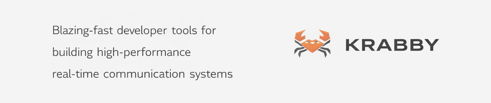

  
  
   
   
  
  <h1>Krabby.</h1>
  
  
<strong>Blazing-fast developer tools for building high-performance real-time communication systems</strong>

  
  

    
  

---

Krabby is an open-source suite for building high-performance real-time communication systems.
Built in Rust, Krabby provides low-level, production-grade primitives that engineering teams can use to design and operate modern messaging platforms with full control over performance, security, and architecture.

The current version of Krabby focuses on delivering flexible, open-source APIs for building real-time multi-media chat systems that meet the standards of platforms like WhatsApp, Telegram, and Signal - without vendor lock-in.

Built with so much ❤️ by the <strong>Krabby</strong> team.

