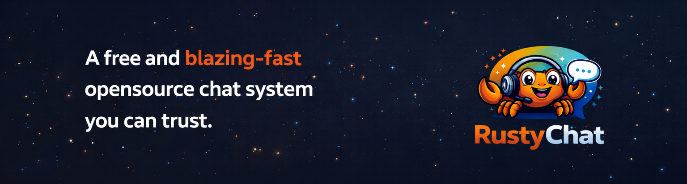

  
  
   
   
  
  <h1>Rusty Chat</h1>
  
  
<strong>A complete open-source chat system supporting text and multimedia communication - including video and audio calls, built with the Rust programming language and the Axum framework.</strong>

  
At it's core, the main goal of the project, is to produce a complete backend-only layer that can be integrated to suit any desired frontend whether on the web, or on mobile platforms.

  
However, we subsequently hope to provide complete/fully-featured frontend layers(web and mobile), to make it easier for users to get started.

  
  

    
    
    
    
    ...more
  

---

## 🚀 Welcome to Rusty Chat

Rusty Chat is an ambitious open-source project dedicated to building a high-performance, secure, and modern communication infrastructure. Leveraging the power of **Rust** and the **Axum** framework, we aim to provide a comprehensive solution for real-time text and multimedia messaging(including high-quality voice and video calls).

## ✨ Core Features

- **Unified Messaging**: Seamless support for text, images, and multimedia files.
- **Personal Spaces**: Customizable private note-taking spaces for personal knowledge management.
- **Real-time Communication**: Architected for low-latency interactions including high-quality voice and video calls.
- **Domain-Driven Design (DDD)**: A clean, modular codebase designed for scalability and maintainability.
- **Robust Security**: Industry-standard authentication using Argon2 hashing and JWT sessions.
- **Cloud-Native Storage**: Scalable handling of multimedia assets with AWS S3 integration.
- **Typed Database Layer**: Reliable data management using PostgreSQL and SQLx.

## 🛠 Technology Stack

- **Backend Core**: [Rust](https://www.rust-lang.org/) — for performance, safety, and fearless concurrency.
- **Backend Framework**: [Axum](https://github.com/tokio-rs/axum) — a modular web framework from the Tokio ecosystem.
- **Data Persistence**: [PostgreSQL](https://www.postgresql.org/) with [SQLx](https://github.com/launchbadge/sqlx) for type-safe queries.
- **Asset Management**: [AWS S3](https://aws.amazon.com/s3/) — providing reliable object storage for multimedia.
- **Asynchronous Runtime**: [Tokio](https://tokio.rs/) — the industry-standard runtime powering the entire system infrastructure.

## 🏗 Project Architecture

...work in progress.

## 🤝 Join the Community

Rusty Chat is being built in the open. It'll be awesome if you'd consider contributing or becoming part of the journey in any way possible.

- **Contribute**: Feel free to pick up an open issue or suggest new features via Pull Requests.
- **Feedback**: Open a discussion or an issue if you have suggestions for improvement.
- **Vision**: Our goal is to create the most performant open-source alternative for modern chat applications.

---

Built with so much ❤️ by the <strong>Rusty Chat</strong> team.

